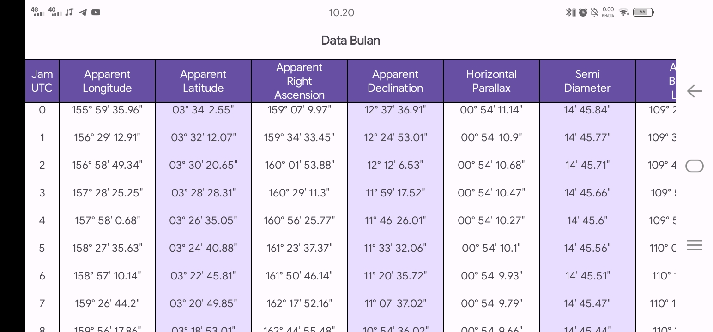

<p align="center">
  
</p>

<h2 align="center"><b>Kanzul Falak</b></h2>
<p align="center">
<b>An application that collects several methods of calculating falak (astronomy) for the purposes of Muslim worship with material design 3.</b>
<p><br>

<p align="center">
<!-- Latest release -->

<!-- Build with Kotlin -->

<!-- License -->

</p>

## About Kanzul Falak

An application that collects several methods of calculating falak (astronomy) for the purposes of Muslim worship with material design 3.

## Screenshot
<div align="center">





</div>

## Feature

- [x] Model JPL DE405 & IAARAS EPM2021 Planetary theory
- [x] VSOP87D & ELPMPP02 semi-analitic
- [x] Jean Meeus from Astronomical Algorithm
- [x] Irsyadul Murid
- [x] Calculate the beginning of prayer times
- [x] Calculate the beginning of the hijri month
- [x] Tahwil tarikh (Gregorian-Hijriyah date conversion)
- [x] Tahwil julian day (Convert Julian day to AD/Hijriyah)
- [x] Hilal visibility graph
- [x] Commemoration of the dead (Selamatan meninggal)
- [x] Missed prayers (Qodho sholat)
- [x] Moon phases
- [x] Solar eclipse
- [x] Lunar eclipse
- [x] Ephemeris Table
- [x] Imsakiyah Schedule
- [x] Calendar Sync
- [x] Tasbih

## Technology used

- 99% Kotlin 1% Java language
- MVVM pattern
- ViewBinding
- ViewModel
- LiveData
- Kotlin coroutines
- SharedPreferences
- Preferences DataStore
- Combine XML with Jetpack Compose

## Contact us

- [Telegram](https://t.me/moonelfalakiy)
- [Grup diskusi Telegram](https://t.me/moonlight_studio01/9)

## License

```
Kanzul Falak
Copyright (C) 2023-2025  Andi Hasan Ashari
GNU General Public License v3.0 but still close source
```
